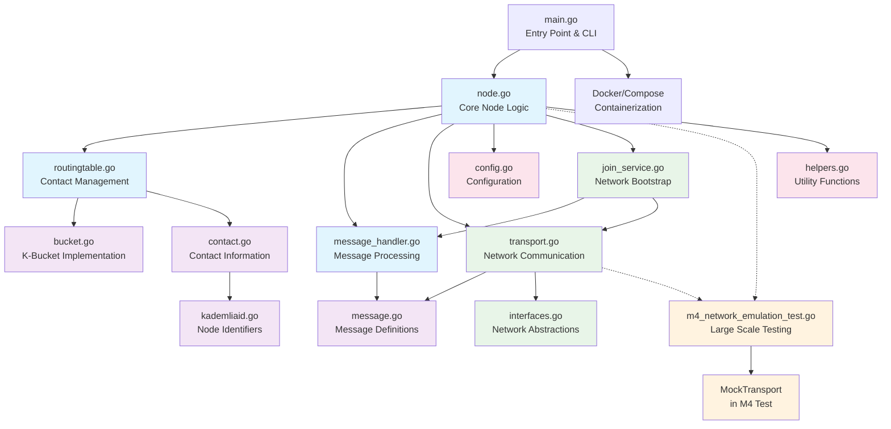
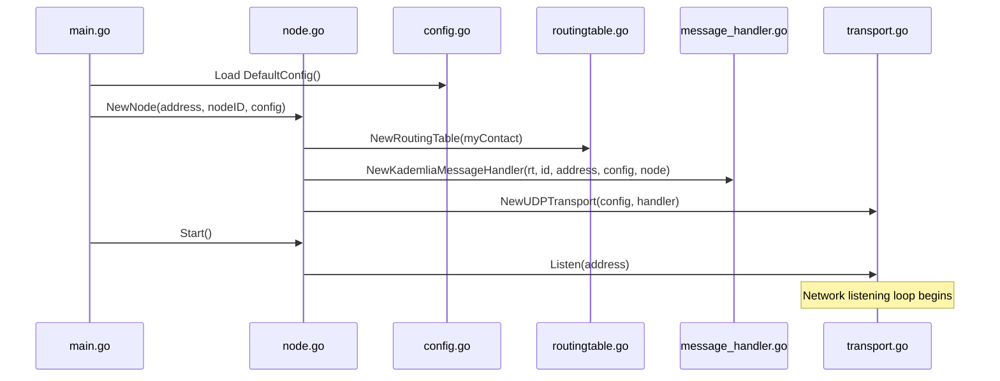
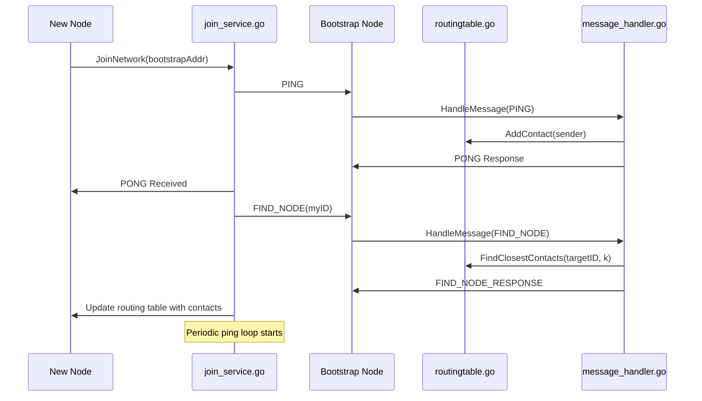
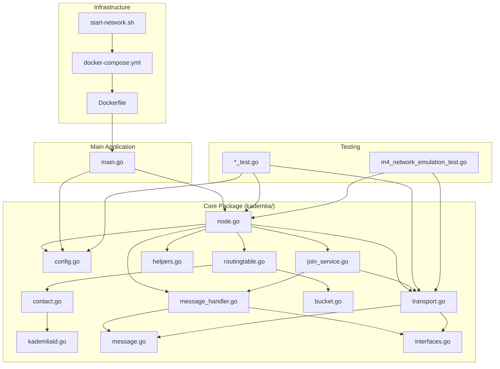

# Kademlia Implementation Architecture Diagram

## System Overview



## Detailed Component Communication

### 1. Core Architecture Flow



### 2. Message Processing Flow

```mermaid
graph LR
    subgraph "Incoming Message Flow"
        UDP[UDP Packet] --> Transport[transport.go<br/>UDPTransport]
        Transport --> Queue[Message Queue<br/>Channel]
        Queue --> MH[message_handler.go<br/>HandleMessage()]
        MH --> RT[routingtable.go<br/>AddContact()]
        MH --> Node[node.go<br/>Data Store Access]
    end
    
    subgraph "Message Types"
        MH --> PING[PING Handler]
        MH --> PONG[PONG Handler]
        MH --> FIND_NODE[FIND_NODE Handler]
        MH --> STORE[STORE Handler]
        MH --> FIND_VALUE[FIND_VALUE Handler]
    end
    
    subgraph "Response Flow"
        PING --> Response[Create Response]
        FIND_NODE --> Response
        STORE --> Response
        FIND_VALUE --> Response
        Response --> Transport
        Transport --> UDP_OUT[UDP Response]
    end
```

### 3. Data Structure Relationships

```mermaid
classDiagram
    class Node {
        +ID: KademliaID
        +Address: string
        +transport: NetworkTransport
        +routingTable: RoutingTableManager
        +handler: MessageHandler
        +config: Config
        +dataStore: map[string]string
        +Start()
        +Stop()
        +Store(key, value)
        +FindValue(key)
    }
    
    class RoutingTable {
        +me: Contact
        +buckets: [160]*bucket
        +AddContact(contact)
        +FindClosestContacts(target, count)
        +getBucketIndex(id)
    }
    
    class Bucket {
        +list: *list.List
        +AddContact(contact)
        +GetContactAndCalcDistance(target)
    }
    
    class Contact {
        +ID: *KademliaID
        +Address: string
        +distance: *KademliaID
        +CalcDistance(target)
    }
    
    class KademliaID {
        +id: [20]byte
        +String()
        +Equals(other)
        +CalcDistance(target)
        +Less(other)
    }
    
    class Message {
        +Type: MessageType
        +MessageID: string
        +Sender: Contact
        +Timestamp: int64
        +Data: interface{}
    }
    
    class UDPTransport {
        +conn: *net.UDPConn
        +messageQueue: chan MessageEnvelope
        +config: *Config
        +handler: MessageHandler
        +Listen(address)
        +SendMessage(msg, addr)
    }
    
    Node --> RoutingTable
    Node --> UDPTransport
    Node --> KademliaMessageHandler
    RoutingTable --> Bucket
    Bucket --> Contact
    Contact --> KademliaID
    UDPTransport --> Message
    KademliaMessageHandler --> Message
```

### 4. Network Bootstrap Process



### 5. File Dependencies



## Key Communication Patterns

### 1. **Layered Architecture**
- **Application Layer**: `main.go` - Entry point and CLI
- **Service Layer**: `node.go`, `join_service.go` - Business logic
- **Message Layer**: `message_handler.go`, `message.go` - Protocol handling
- **Transport Layer**: `transport.go`, `interfaces.go` - Network abstraction
- **Data Layer**: `routingtable.go`, `bucket.go`, `contact.go` - Data structures

### 2. **Interface-Based Design**
- `NetworkTransport` interface in `interfaces.go` allows swapping transport implementations
- `RoutingTableManager` interface enables different routing strategies
- `MessageHandler` interface supports different message processing approaches

### 3. **Event-Driven Communication**
- UDP messages trigger event processing through channels
- Message queue decouples network I/O from message processing
- Goroutines handle concurrent message processing

### 4. **Dependency Injection**
- Configuration passed down through constructor functions
- Handlers injected into transport for loose coupling
- Node reference injected into message handler for data access

### 5. **Testing Strategy**
- Mock implementations (`MockTransport` in M4 tests) replace real network
- Test files mirror production structure for comprehensive testing
- Network emulation enables large-scale testing without real network overhead

## File Interaction Summary

| File | Primary Role | Key Dependencies | Communication Method |
|------|-------------|------------------|---------------------|
| `main.go` | Entry point, CLI | `node.go`, `config.go` | Function calls |
| `node.go` | Core orchestration | All core components | Direct references |
| `transport.go` | Network I/O | `message.go`, `interfaces.go` | Channels, callbacks |
| `message_handler.go` | Protocol logic | `routingtable.go`, `node.go` | Interface methods |
| `routingtable.go` | Contact management | `bucket.go`, `contact.go` | Direct data access |
| `join_service.go` | Bootstrap service | `transport.go`, `message_handler.go` | Async messages |
| `m4_network_emulation_test.go` | Large-scale testing | Mock versions of core components | Test doubles |

This architecture demonstrates a clean separation of concerns with well-defined interfaces and communication patterns, making the system maintainable and testable.